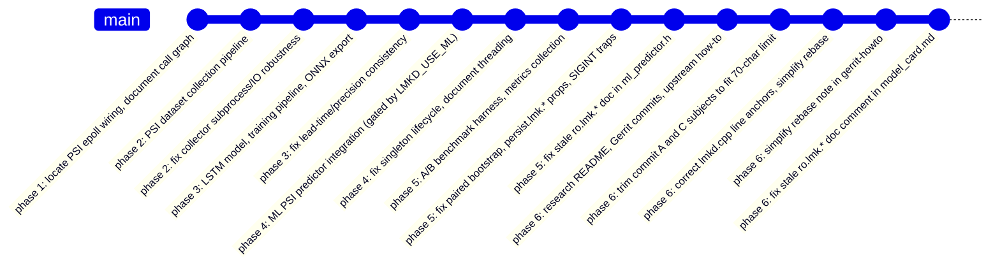

# 01 — Changes summary

## TL;DR

This branch adds an optional, build-flag-gated ML predictor to `lmkd` (≈60 LOC
of insertion in `lmkd.cpp`, all under `#ifdef LMKD_USE_ML`) and a complete
research pipeline (collection, labeling, training, ONNX export, A/B bench
harness, Gerrit submission docs) under [`research/`](../research). With
`LMKD_USE_ML` undefined — the default — the daemon's compiled output is
byte-equivalent to upstream.

## File-by-file diff stat

The numbers below come from `git diff main..HEAD --stat` on this branch
(commit range `e867d32..63c0dc9`).

### Production code

| Path | LOC | Kind |
|------|-----|------|
| [`lmkd.cpp`](../lmkd.cpp) | +60 | Modified (all changes inside `#ifdef LMKD_USE_ML`) |
| [`Android.bp`](../Android.bp) | +15 | Modified (new `lmkd_ml_defaults`, disabled by default) |
| [`ml_predictor.h`](../ml_predictor.h) | +138 | Added |
| [`ml_predictor.cpp`](../ml_predictor.cpp) | +307 | Added |

### Research / training pipeline

| Path | LOC | Kind |
|------|-----|------|
| [`research/collector.py`](../research/collector.py) | +356 | Added |
| [`research/label.py`](../research/label.py) | +121 | Added |
| [`research/dataset.py`](../research/dataset.py) | +342 | Added |
| [`research/model.py`](../research/model.py) | +114 | Added |
| [`research/train.py`](../research/train.py) | +653 | Added |
| [`research/export_onnx.py`](../research/export_onnx.py) | +149 | Added |
| [`research/bench_onnx.py`](../research/bench_onnx.py) | +109 | Added |
| [`research/eda.ipynb`](../research/eda.ipynb) | +97 | Added |
| [`research/requirements.txt`](../research/requirements.txt) | +12 | Added |
| [`research/bench/ab.sh`](../research/bench/ab.sh) | +264 | Added |
| [`research/bench/collect_metrics.sh`](../research/bench/collect_metrics.sh) | +177 | Added |
| [`research/bench/aggregate.py`](../research/bench/aggregate.py) | +246 | Added |
| [`research/bench/analyze.py`](../research/bench/analyze.py) | +320 | Added |
| [`research/bench/workloads/*.sh`](../research/bench/workloads) | +306 | Added (5 workloads) |
| [`research/.gitignore`](../research/.gitignore) | +25 | Added |

### Documentation and upstream artifacts

| Path | LOC | Kind |
|------|-----|------|
| [`README_research.md`](../README_research.md) | +420 | Added |
| [`plan-executable.md`](../plan-executable.md) | +398 | Added |
| [`research/README.md`](../research/README.md) | +105 | Added |
| [`research/bench/README.md`](../research/bench/README.md) | +167 | Added |
| [`research/model_card.md`](../research/model_card.md) | +93 | Added |
| [`research/notes/phase1-callgraph.md`](../research/notes/phase1-callgraph.md) | +102 | Added |
| [`research/notes/phase1-epoll-wiring.md`](../research/notes/phase1-epoll-wiring.md) | +84 | Added |
| [`research/upstream/commit-messages.md`](../research/upstream/commit-messages.md) | +147 | Added |
| [`research/upstream/gerrit-howto.md`](../research/upstream/gerrit-howto.md) | +170 | Added |

Total: 32 files, +5,497 lines.

## Commit history (15 commits, grouped by phase)

(Subjects are the exact `git log main..HEAD --oneline` output, lightly
abbreviated where the original exceeded chart width.)

## Behaviorally-unchanged build path

With `LMKD_USE_ML` undefined (the default in [`Android.bp`](../Android.bp)),
the lmkd binary produced from this branch is byte-equivalent to one built
from upstream `main`. The only insertion sites in `lmkd.cpp` are:

- **Lines 63–65** — include of `ml_predictor.h` inside `#ifdef LMKD_USE_ML`
  ([`lmkd.cpp:63`](../lmkd.cpp#L63)).
- **Lines 2936–2989** — the ML hook block inside `__mp_event_psi`
  ([`lmkd.cpp:2936`](../lmkd.cpp#L2936)).
- **Lines 4260–4262** — the one-line `init_from_properties()` call inside
  `main()` ([`lmkd.cpp:4260`](../lmkd.cpp#L4260)).

All three blocks are inside `#ifdef LMKD_USE_ML` / `#endif` pairs, which
were independently re-verified during Phase 6
([commit `cd97ea8`](../README_research.md)). The new files
`ml_predictor.{h,cpp}` are not added to any source list outside the
`lmkd_ml_defaults` cc_defaults stanza in `Android.bp`, which itself has
`enabled: false`.
