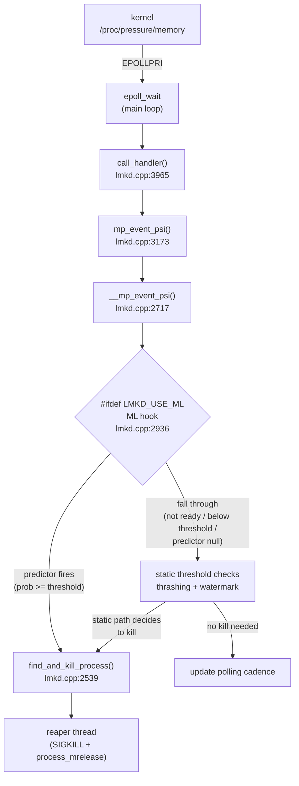
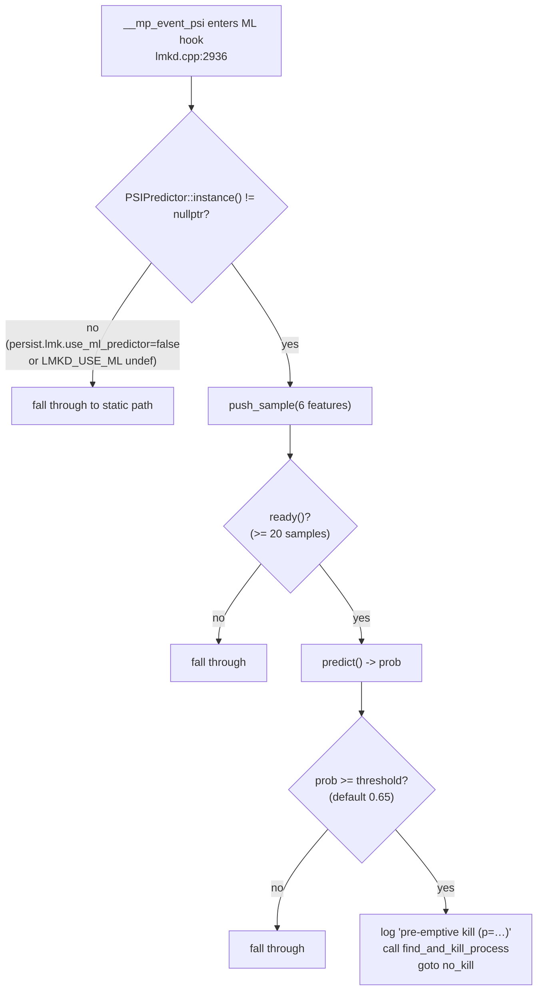
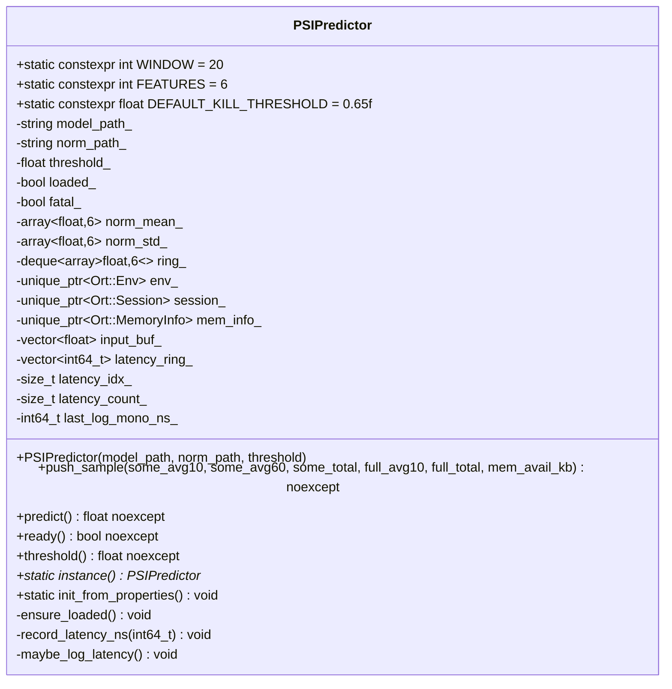

# 02 — Architecture

## High-level data flow

The ML hook is positioned **inside** `__mp_event_psi` so it sees the same
parsed PSI sample (and the same `mi` / `wi` snapshots) that the static
decision tree would use one block later. Pre-emptive kills go through the
exact same `find_and_kill_process` victim-selection path — only the
*trigger* changes.

## ML hook decision tree

The four fall-through conditions are listed exhaustively in
[05-integration.md](05-integration.md#fallback-behavior).

## PSIPredictor class shape

Class declaration: [`ml_predictor.h:62`](../ml_predictor.h#L62).

Key contract notes:

- All four mutator/observer methods (`push_sample`, `predict`, `ready`,
  `threshold`) are marked `noexcept`. Any exception escaping ORT is caught
  internally; `predict()` returns `-1.0f` on failure and the caller treats
  that the same as "not ready" — i.e. fall through to the static path.
- The singleton is owned by a function-local `std::unique_ptr` inside
  `instance()`. It is constructed at most once via `init_from_properties()`
  (call-once semantics) and destroyed at process exit, which releases the
  Ort::Env and Ort::Session in deterministic order.
- The model and normalization stats are loaded **lazily** on the first
  `push_sample()` so daemon startup is never blocked by I/O. If load
  fails, `fatal_` is latched and `instance()` continues to return a
  pointer whose `ready()` is permanently `false`.
- Threading: single-owner contract. `lmkd`'s main loop is the sole caller;
  `instance()` itself is thread-safe (call_once), but the returned object
  is not internally synchronized.

## What was not changed

The branch deliberately leaves the following files untouched. Anyone
auditing the diff can confirm with `git diff main..HEAD -- <path>`:

- [`include/lmkd.h`](../include/lmkd.h) — public protocol header.
- [`statslog.h`](../statslog.h), [`statslog.cpp`](../statslog.cpp) —
  kill-stat reporting (the ML pre-emptive kill funnels through the same
  `find_and_kill_process` and so inherits existing statslog behavior).
- [`reaper.h`](../reaper.h), [`reaper.cpp`](../reaper.cpp) — async
  SIGKILL + `process_mrelease` worker.
- [`watchdog.h`](../watchdog.h), [`watchdog.cpp`](../watchdog.cpp) —
  daemon watchdog.
- [`libpsi/`](../libpsi) — the PSI fd wiring layer
  (`init_psi_monitor`, `register_psi_monitor`).
- [`liblmkd_utils.cpp`](../liblmkd_utils.cpp) — client-side helpers.
- [`lmkd.rc`](../lmkd.rc) — init script.
- [`OWNERS`](../OWNERS), [`PREUPLOAD.cfg`](../PREUPLOAD.cfg) — Gerrit
  metadata.
- [`event.logtags`](../event.logtags) — atom IDs.

The absence of changes to `event.logtags` and `statslog.{h,cpp}` is
intentional: the ML pre-emptive kill emits the *same* logtag with
`kill_desc = "ml predictor pre-emptive kill"`, so downstream analytics
pipelines (`westworld`, `clearcut`) do not need a new schema.
