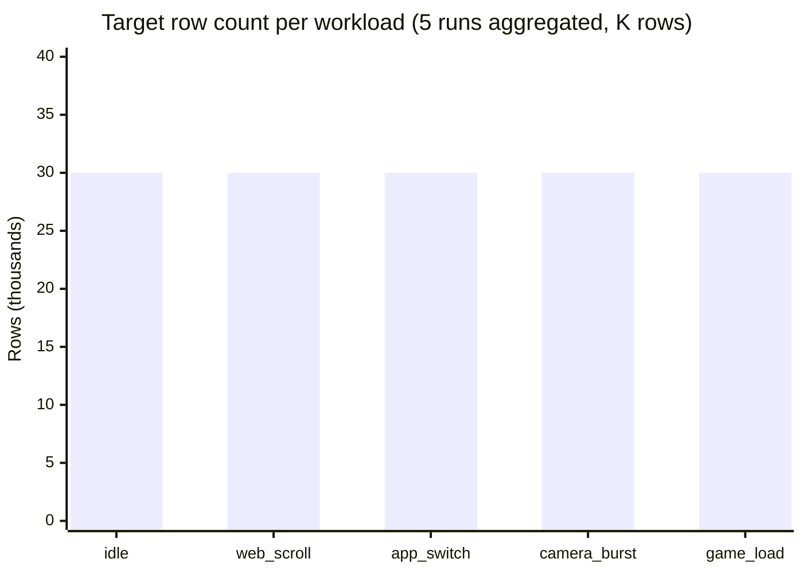

# 03 — Data pipeline

## End-to-end flow

```mermaid
flowchart LR
    DEV["Android device<br/>(rooted)"] -- "adb shell<br/>cat /proc/pressure/memory<br/>100ms cadence" --> COL["collector.py<br/>(host)"]
    DEV -- "logcat -b system -v epoch<br/>lmkd kill lines" --> COL
    COL --> CSV[("raw CSV<br/>14 columns")]
    CSV --> LBL["label.py<br/>(kill-window labeler)"]
    LBL --> LCSV[("labeled CSV<br/>+ kill_within_200_300ms")]
    LCSV --> DS["dataset.py<br/>(windowing + z-score)"]
    DS --> TR["train.py<br/>(LSTM + BCE pos_weight=10)"]
    TR --> PT[("psi_predictor.pt")]
    PT --> EX["export_onnx.py<br/>(opset 11, parity ≤ 1e-5)"]
    EX --> ONNX[("psi_predictor.onnx<br/>normalization.json")]
    ONNX -- "adb push" --> DEVOUT["/system/etc/lmkd/"]
```



Sources:
[`research/collector.py`](../research/collector.py),
[`research/label.py`](../research/label.py),
[`research/dataset.py`](../research/dataset.py),
[`research/train.py`](../research/train.py),
[`research/export_onnx.py`](../research/export_onnx.py).

## Collector CSV columns

`collector.py` writes a header row with these 14 columns
([`research/collector.py:58`](../research/collector.py#L58)):

| # | Column | Source | Notes |
|---|--------|--------|-------|
| 1 | `timestamp_unix` | host `time.time()` | Host-side clock; toybox `date +%s.%N` is unreliable on AOSP. |
| 2 | `scenario` | CLI arg | One of `idle`, `web_scroll`, `app_switch`, `camera_burst`, `game_load`. |
| 3 | `some_avg10` | `/proc/pressure/memory` | "some" PSI 10s avg. |
| 4 | `some_avg60` | same | 60s avg. |
| 5 | `some_avg300` | same | 300s avg (not in model). |
| 6 | `some_total` | same | Cumulative stall μs. |
| 7 | `full_avg10` | same | "full" PSI 10s avg. |
| 8 | `full_avg60` | same | 60s avg (not in model). |
| 9 | `full_avg300` | same | 300s avg (not in model). |
| 10 | `full_total` | same | Cumulative stall μs. |
| 11 | `mem_available_kb` | `/proc/meminfo` MemAvailable | Mirrored on-device via `easy_available * page_k`. |
| 12 | `swap_free_kb` | `/proc/meminfo` SwapFree | Diagnostic, not in model. |
| 13 | `swap_total_kb` | `/proc/meminfo` SwapTotal | Diagnostic, not in model. |
| 14 | `kill_event` | `logcat` parser | `1` on a sample co-located with an lmkd kill line, else `0`. |

Of these, the model uses six (see [04-model.md §Feature order](04-model.md));
the remaining columns are kept for diagnostics, EDA, and future feature
experiments.

## Labeling window

`label.py` post-processes the raw CSV by walking each `kill_event=1`
timestamp `T_k` and marking every row whose `timestamp_unix` falls in
`[T_k − 300 ms, T_k − 200 ms]` as a positive
(`kill_within_200_300ms = 1`). This window is chosen so the model is
trained to fire **200 ms before** the kernel-driven kill — enough lead
time to evict and reclaim memory before user-visible jank.

```
time axis (ms) ─────────────────────────────────────────►

   ┌───────── labeled positive window ─────────┐
   │                                           │
T_k-300                                     T_k-200                 T_k
   ▼                                           ▼                      ▼
───┬───┬───┬───┬───┬───┬───┬───┬───┬───┬───┬───┬───┬───┬───┬───┬───┬───┬─►
   │ + │ + │ + │ + │ + │ + │ + │ + │ + │ + │ + │ . │ . │ . │ . │ . │ . │ X
   └───┴───┴───┴───┴───┴───┴───┴───┴───┴───┴───┴───┴───┴───┴───┴───┴───┘
                                                                       ▲
                                                              kill recorded
                                                              (kill_event=1)
```

`+` = positive sample (label 1). `.` = negative inside the no-fire zone.
`X` = the kill row itself. The 100 ms gap between the window's trailing
edge and `T_k` is the model's **operating budget**: if it fires anywhere
in the window, the resulting pre-emptive kill still completes ≥100 ms
before the kernel would have torn things down (and well before the user
sees a stall).

## Workload scenarios

Five scripts under
[`research/bench/workloads/`](../research/bench/workloads) drive the
device into representative pressure regimes:

| Scenario | Purpose |
|----------|---------|
| `idle` | Steady-state baseline; near-zero memory pressure for false-positive screening. |
| `web_scroll` | Chrome long-page scroll; sustained moderate `some_avg10`. |
| `app_switch` | Aggressive recent-apps switching; bursty allocation pattern. |
| `camera_burst` | Camera launch + rapid still capture; large continuous allocations. |
| `game_load` | Cold start of a heavyweight game; the classic pre-kill scenario. |

These are also the LOSO (leave-one-scenario-out) cross-validation folds
in training; see [04-model.md §Validation](04-model.md).

## Dataset size targets

Plan-executable.md Phase 2 requires:

- **≥ 50,000 timesteps total** across the 5 workloads.
- **Positive-class fraction in [0.005, 0.05]** — between 0.5% and 5% of
  rows fall inside a 200–300 ms pre-kill window.

Target shape (per workload, 5 runs × ~30 minutes × 10 Hz ≈ 9,000 rows;
5 workloads × ~6,000 effective rows after cleaning ≈ 150K rows total):



(Bars represent **plan targets**, not collected data. No collection run
has been completed inside this artifact.)

## What can go wrong (and where it's handled)

- `adb shell` subprocess dying mid-collection — caught by the robustness
  fix in [`commit 2dab3e5`](../README_research.md); collector exits
  cleanly with the partial CSV preserved.
- Toybox `date +%s.%N` returning an unparseable timestamp on AOSP — fixed
  by using host-side `time.time()` instead
  ([`collector.py`](../research/collector.py)).
- Atomic-write race during label generation — `label.py` writes to a
  `.tmp` sibling then renames (Phase 3 fix in
  [`commit 398d53e`](../README_research.md)).
