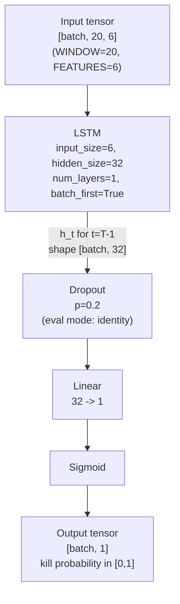

# 04 — Model

## Figure 4.1: PSIPredictor architecture



Source: [`research/model.py:73`](../research/model.py#L73).

Equivalent ASCII view:

```
                  [batch, 20, 6]                 input PSI window
                        │
                ┌───────▼────────┐
                │   LSTM         │  input_size=6
                │   hidden=32    │  num_layers=1
                │   batch_first  │  batch_first=True
                └───────┬────────┘
                        │ last timestep h_T
                  [batch, 32]
                        │
                ┌───────▼────────┐
                │  Dropout(0.2)  │  (train only)
                └───────┬────────┘
                        │
                ┌───────▼────────┐
                │  Linear 32→1   │
                └───────┬────────┘
                        │
                ┌───────▼────────┐
                │   Sigmoid      │
                └───────┬────────┘
                        │
                  [batch, 1]      kill_prob ∈ [0,1]
```

## Parameter count

The LSTM-gate formula is `4 × (input·hidden + hidden·hidden + 2·hidden)`
(four gates: input, forget, cell, output), each with input weights,
recurrent weights, and **two** bias vectors (PyTorch's default
`bias=True`).

| Layer | Formula | Count |
|-------|---------|------:|
| LSTM weights + biases | `4 × (6·32 + 32·32 + 2·32)` = `4 × (192 + 1024 + 64)` = `4 × 1280` | 5,120 |
| Linear (32 → 1) | `32 + 1` (weight + bias) | 33 |
| **Total** | | **5,153** |

Budget cap from plan-executable.md Phase 3 is 200,000 parameters, so the
realized model uses **2.6%** of that budget. The compact size is what
makes the ≤2 ms inference and ≤4 MB RSS targets in
[06-expected-performance.md](06-expected-performance.md) plausible.

## Feature order (locked)

The six-feature ordering is load-bearing across three independent
artifacts; any reordering silently breaks model-to-daemon parity.

| Index | Feature | Range/unit |
|------:|---------|------------|
| 0 | `some_avg10` | float, 0–100 (PSI percent) |
| 1 | `some_avg60` | float, 0–100 |
| 2 | `some_total` | float (μs, monotonically increasing) |
| 3 | `full_avg10` | float, 0–100 |
| 4 | `full_total` | float (μs) |
| 5 | `mem_available_kb` | float (kilobytes) |

The exact ordering is mirrored in three places, which must stay in sync:

1. [`research/dataset.py:81`](../research/dataset.py#L81) — Python
   `FEATURES` list (canonical).
2. [`ml_predictor.h:78`](../ml_predictor.h#L78) — C++ `push_sample`
   positional argument order.
3. ONNX input tensor `psi_window` shape `[batch, 20, 6]`, with the same
   axis-2 ordering (consumed by the on-device runner).

## Training pipeline

| Knob | Value | Source |
|------|-------|--------|
| Loss | `BCEWithLogitsLoss(pos_weight=10.0)` | [`research/train.py:351`](../research/train.py#L351) |
| Optimizer | Adam, default `lr=1e-3` | [`research/train.py:349`](../research/train.py#L349) |
| Batch size | 64 (default) | `train.py --batch_size` |
| Epochs | 20 (default) | `train.py --epochs` |
| Validation | Leave-one-scenario-out (LOSO) | 5 folds, one per workload |
| Lead-time lookback | `EARLY_ALARM_LOOKBACK_STEPS = 5` (i.e. 500 ms at 10 Hz) | [`research/train.py:91`](../research/train.py#L91) |

The `pos_weight=10.0` term compensates for the class imbalance baked into
the labeling window (positives are 0.5%–5% of rows per
[03-data-pipeline.md](03-data-pipeline.md#dataset-size-targets)); without
it the model would degenerate to the all-zero classifier.

### Evaluation targets

From plan-executable.md Phase 3:

- **Recall ≥ 0.85** on held-out scenario.
- **Precision ≥ 0.70** on held-out scenario.
- **Lead-time** — ≥ 80% of true positives fire ≥ 100 ms before the
  labeled kill instant. The `EARLY_ALARM_LOOKBACK_STEPS = 5` window is
  shared between the `precision_recall` and `lead_times` reporting
  functions in `train.py` — this consistency was the explicit Phase 3
  fix in [`commit 398d53e`](../README_research.md).

(All three are **targets**, not measured numbers. No model has been
trained inside this artifact.)

## ONNX export

`export_onnx.py` ([source](../research/export_onnx.py)) converts the
trained `psi_predictor.pt` to ONNX with the following contract:

| Field | Value |
|-------|-------|
| `opset_version` | 11 |
| Input name | `psi_window` |
| Input shape | `[batch, 20, 6]` (batch dynamic) |
| Output name | `kill_prob` |
| Output shape | `[batch, 1]` |
| `dynamic_axes` | `{psi_window: {0: "batch"}, kill_prob: {0: "batch"}}` |
| Parity check | `max(abs(pytorch − onnxruntime)) ≤ 1e-5` on 100 random windows |

Parity is enforced inline by `export_onnx.py`; export exits with status 3
if any of the 100 sampled windows exceeds the 1e-5 threshold
([`research/export_onnx.py:30`](../research/export_onnx.py#L30)).

## C++ inference contract

On the device side, [`ml_predictor.cpp`](../ml_predictor.cpp) applies the
**identical** z-score normalization that the Python pipeline applies,
using the `normalization.json` sidecar produced alongside the `.onnx`
file. Concretely:

- The sidecar JSON layout matches
  [`research/dataset.py`](../research/dataset.py)'s `NormStats.to_json`:
  `{"feature_order": [...], "mean": [...], "std": [...]}`.
- Normalization is applied in `push_sample` (so `predict` is
  branch-light); each feature `x_i` becomes `(x_i − μ_i) / σ_i`.
- The input tensor backing store is pre-allocated to
  `WINDOW × FEATURES = 120` floats and reused across `predict` calls; no
  per-call allocation.
- ONNX Runtime is configured with `intra_op_num_threads = 1` and
  `GraphOptimizationLevel::ORT_ENABLE_BASIC` to keep tail latency
  predictable.

The Phase 5 bench gate ([`research/bench/analyze.py`](../research/bench/analyze.py))
will reject any deployment whose measured p99 exceeds 2 ms.
