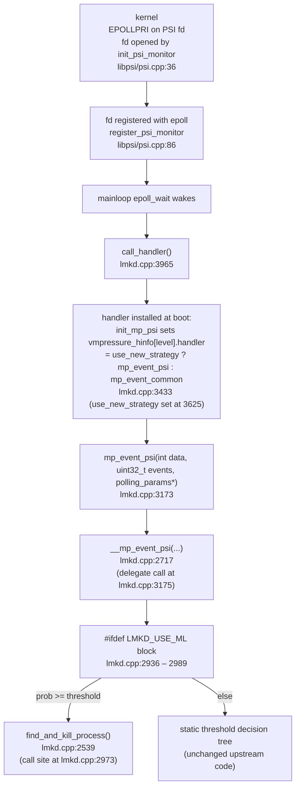
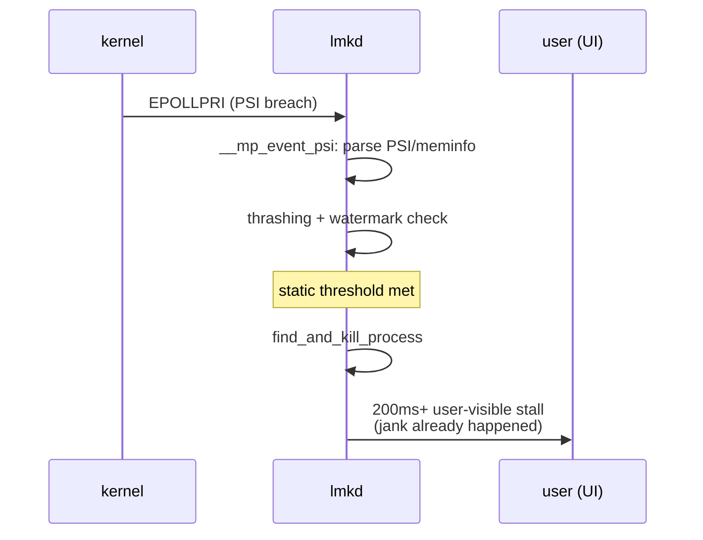
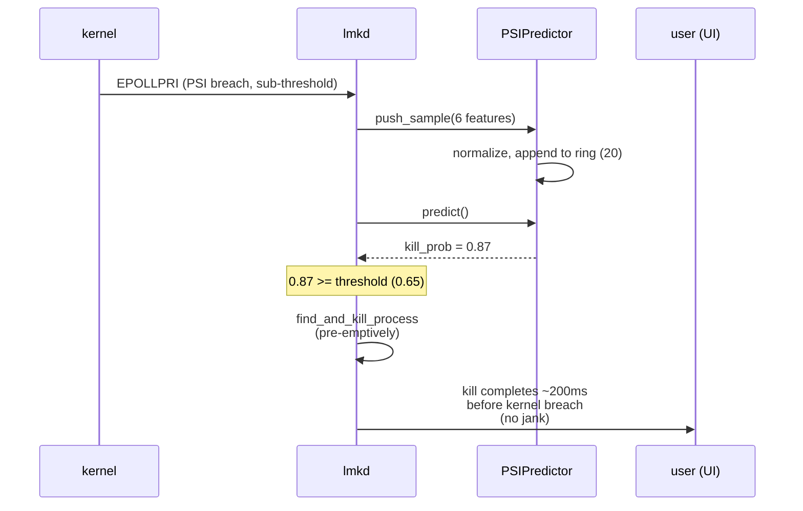

# 05 — Integration

## Where the hook lives

The ML predictor is invoked from exactly one site: inside `__mp_event_psi`,
between the PSI/meminfo/vmstat parsing and the existing static threshold
decision tree. The wiring chain from the kernel epoll fd down to the hook
is unchanged from upstream — only the body of `__mp_event_psi` gains a
guarded block.



Single-line summary of the relevant anchors:

- `__mp_event_psi` body starts at
  [`lmkd.cpp:2717`](../lmkd.cpp#L2717).
- ML hook lives at
  [`lmkd.cpp:2936`](../lmkd.cpp#L2936) – [`lmkd.cpp:2989`](../lmkd.cpp#L2989).
- `find_and_kill_process` call from inside the ML hook is at
  [`lmkd.cpp:2973`](../lmkd.cpp#L2973).
- Thin wrapper `mp_event_psi` is at
  [`lmkd.cpp:3173`](../lmkd.cpp#L3173); the delegation call to
  `__mp_event_psi` is on the next line,
  [`lmkd.cpp:3175`](../lmkd.cpp#L3175).
- `call_handler` is at
  [`lmkd.cpp:3965`](../lmkd.cpp#L3965).
- The handler is wired in at
  [`lmkd.cpp:3433`](../lmkd.cpp#L3433) (selection variable
  `use_new_strategy` is computed at
  [`lmkd.cpp:3625`](../lmkd.cpp#L3625)).
- The one-shot init call is at
  [`lmkd.cpp:4261`](../lmkd.cpp#L4261).
- The `#include` of the predictor header is at
  [`lmkd.cpp:63`](../lmkd.cpp#L63), guarded by `#ifdef LMKD_USE_ML`.

## Before / after kill decision flow

### Before (upstream, static thresholds)



### After (ML path enabled)



### ASCII timing diagram — 200 ms lead-time hypothesis

```
time (ms) ─────────────────────────────────────────────────────────►

upstream (static)
     PSI breach ─────────────► static threshold ───► kill ───► reap
     |  parse  |   evaluate   |   victim sel   | SIGKILL | mrelease |
     0        ~1              ~3              ~5      ~10        ~30
                                                  ▲
                                                  └─ user stall begins here

ML path
     prior PSI samples accumulate
     |─10Hz────10Hz────10Hz────10Hz─| predict()=0.87  ───► kill ───► reap
                                          ▲                       ▲
                                          │                       │
                                  T_kill_predicted        T_kernel_breach
                                          │                       │
                                          └────  ≥100ms lead  ────┘
                                          (target: 80% of TP cases)
```

The "≥100 ms lead time on ≥80% of true positives" target is enforced in
training by `EARLY_ALARM_LOOKBACK_STEPS = 5` in
[`research/train.py:91`](../research/train.py#L91), shared between the
precision/recall and lead-time reporting paths.

## Build flag matrix

| Build | Runtime property | Behavior |
|-------|------------------|----------|
| `LMKD_USE_ML` **undefined** (default) | n/a | `ml_predictor.{h,cpp}` are not compiled, libonnxruntime is not linked, no symbols added. Binary is byte-equivalent to upstream. |
| `LMKD_USE_ML` defined, `persist.lmk.use_ml_predictor=false` | property `false` | Predictor code is compiled and linked. `init_from_properties()` reads the property, sees `false`, leaves the singleton `nullptr`. All hook checks `PSIPredictor::instance()` short-circuit; static path runs unchanged. |
| `LMKD_USE_ML` defined, `persist.lmk.use_ml_predictor=true` | property `true` | Full ML path active. Singleton constructed at startup; model + sidecar lazy-loaded on first `push_sample`. |

The default `Android.bp` shipping with this branch has `enabled: false`
on the `lmkd_ml_defaults` cc_defaults, so a stock `lunch && m lmkd`
produces the upstream-byte-equivalent build.

## Fallback behavior

The ML hook falls through to the static-threshold path whenever **any** of
these conditions holds (verified against
[`lmkd.cpp:2954`](../lmkd.cpp#L2954)):

1. **Predictor singleton is null** — either the build doesn't define
   `LMKD_USE_ML`, or `persist.lmk.use_ml_predictor` was `false` at boot.
2. **Not ready** — fewer than `WINDOW=20` samples have been pushed; the
   ring buffer hasn't been filled yet.
3. **Below threshold** — `predict()` returned a probability strictly less
   than the configured `threshold()` (default `0.65`).
4. **Model load failed** — the ONNX session failed to construct (file
   missing, malformed normalization JSON, ORT init exception). The
   predictor enters `fatal_=true`; `predict()` returns `-1.0f` forever,
   which is `< threshold` for any positive threshold.

In all four cases the daemon falls through to the unchanged static
threshold logic immediately below the hook block, so a misconfigured ML
deployment cannot cause kills to *stop* — at worst it reverts to the
behavior of an upstream `lmkd` build.
