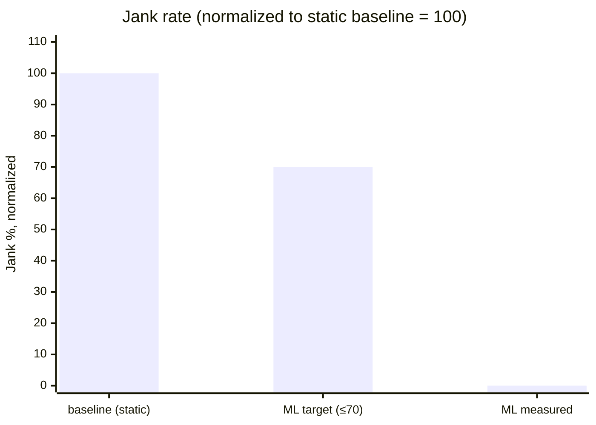
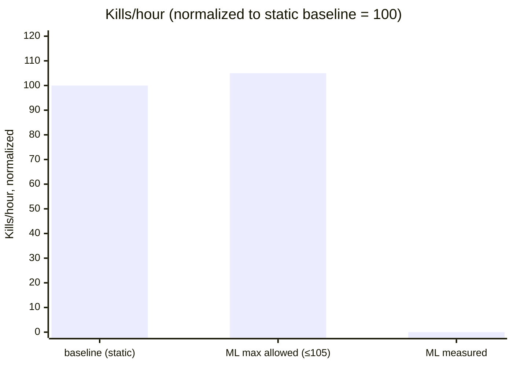
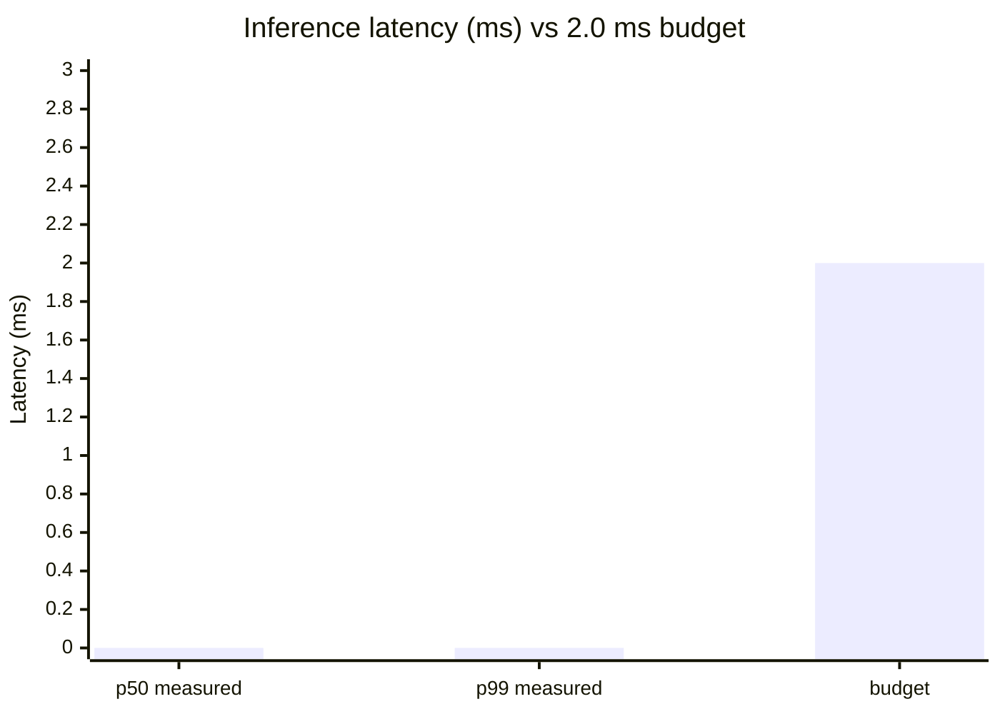

# 06 — Expected performance (target envelopes)

> ⚠️ All numbers in this document are **target envelopes** from plan.md §2, not
> measured results. The `<measured>` column is `<TBD>` until the Phase 5 bench
> harness (research/bench/ab.sh) is run on a rooted Android device. Do not
> cite any number here as if it were an empirical finding.

The four primary gates below come from
[plan.md](../plan.md) §2 "Success metrics". Each subsection states the
target, the hypothesis that motivates it, and a chart whose `<measured>`
position is reserved as `<TBD>`. Every bar labeled "measured" is a
placeholder, not a result.

The bench harness that *will* populate these numbers — once a rooted
device and a trained model are both available — lives at
[`research/bench/ab.sh`](../research/bench/ab.sh) (paired A/B run),
[`research/bench/collect_metrics.sh`](../research/bench/collect_metrics.sh)
(`dumpsys gfxinfo` + `/proc/lmkd/status` sampling), and
[`research/bench/analyze.py`](../research/bench/analyze.py) (paired
bootstrap, gate evaluation).

---

## 6.1 UI jank reduction (primary outcome)

- **Target:** ≥ 30% reduction in janky-frames percentage vs. the
  static-threshold baseline.
- **Hypothesis:** pre-emptive kills triggered 200 ms ahead of the
  kernel-driven threshold avoid the user-visible stall window. By the
  time `process_mrelease` returns the freed pages back to the kernel,
  the heaviest allocation in the workload has already been compensated
  for.
- **Pass criterion:** `jank_delta_pct <= -30%`, enforced at
  [`research/bench/analyze.py:159`](../research/bench/analyze.py#L159)
  (`JANK_DELTA_PCT_MAX = -30.0`).



ASCII fallback (the third bar is a `<TBD>` placeholder, not a measured
value):

```
baseline (static)   ████████████████████████████████████████  100
ML target (≤70%)    ████████████████████████████              ≤70  (-30% target)
ML measured         ░░░░░░░░░░░░░░░░░░░░░░░░░░░░░░░░░░░░░░░░  <TBD>
```

---

## 6.2 Kill-frequency neutrality

- **Target:** ≤ 5% increase in kills/hour vs. baseline.
- **Hypothesis:** the class-weighted loss
  (`BCEWithLogitsLoss(pos_weight=10.0)`) and the requirement that
  Precision ≥ 0.70 on held-out scenarios bias the model away from
  spurious fires. Even on an *over-firing* model, the worst-case kill
  count is bounded because every pre-emptive kill displaces a near-future
  static kill on the same victim cohort.
- **Pass criterion:** `kills_per_hour_delta_pct <= +5%`.



ASCII fallback:

```
baseline             ████████████████████████████████████████  100
ML max allowed       ██████████████████████████████████████████ ≤105
ML measured          ░░░░░░░░░░░░░░░░░░░░░░░░░░░░░░░░░░░░░░░░░ <TBD>
```

---

## 6.3 Inference latency budget

- **Target:** ≤ 2 ms p99 per `predict()` call.
- **Hypothesis:** at 5,153 parameters, with `intra_op_num_threads = 1`,
  `GraphOptimizationLevel::ORT_ENABLE_BASIC`, a pre-allocated input
  tensor and a tight `[1, 20, 6]` shape, ORT's per-call overhead
  dominates and is bounded. The remaining variance is page-cache and
  scheduler jitter, both of which are also bounded on the lmkd
  realtime-prio thread.



The first two bars (`p50 measured`, `p99 measured`) are `<TBD>`; the
third is the **plan budget**, not a measurement. Latency telemetry is
emitted by `maybe_log_latency()` every 10 s as
`lmkd-ml: inf p50=X.XXms p99=Y.YYms (n=…)`, consumable with
`logcat -s lmkd-ml:I`.

---

## 6.4 Memory overhead budget

- **Target:** ≤ 4 MB RSS delta vs. baseline `lmkd`.

Estimated breakdown (per [`ml_predictor.h`](../ml_predictor.h) layout +
ORT documented footprint):

| Component | Estimated size | Notes |
|-----------|---------------:|-------|
| Model file (mmapped) | ≤ ~100 KB | 5,153 parameters × 4 bytes ≈ 20 KB raw; ONNX wrapper + opset 11 graph ≈ 80 KB framing. |
| `Ort::Env` | ~100 KB | Logger + thread-pool stubs (single intra-op thread). |
| `Ort::Session` | ~1–2 MB | Graph + execution-plan caches. |
| Ring buffer (`std::deque`) | 20 × 6 × 4 = 480 B + deque overhead | Fixed at construction. |
| Pre-allocated input tensor (`input_buf_`) | 480 B | `WINDOW × FEATURES × 4`. |
| Normalization stats (`norm_mean_`, `norm_std_`) | 48 B | 2 × `array<float, 6>`. |
| Latency histogram ring | 2 KB | 256 × `int64_t`. |
| **Headroom in 4 MB budget** | **~2 MB** | Leaves margin for ORT runtime arenas. |

Measured RSS delta: `<TBD>`. Will be sampled by
[`research/bench/collect_metrics.sh`](../research/bench/collect_metrics.sh)
from `/proc/<lmkd_pid>/status` during the A/B run.

---

## 6.5 Lead-time hypothesis (model output, not lmkd metric)

This is a **model-output** target — measured from the labeled validation
set, not from the device.

- **Target:** ≥ 80% of true positives fire ≥ 100 ms before the labeled
  kill instant.
- **Mechanism:** `EARLY_ALARM_LOOKBACK_STEPS = 5` in
  [`research/train.py:91`](../research/train.py#L91) configures the
  lookback window for both the precision/recall and the lead-time
  reporting functions. The same constant is used in both, by design — the
  Phase 3 fix in [`commit 398d53e`](../README_research.md) eliminated an
  earlier inconsistency where the two reports computed different
  positive sets.

```
time (relative to T_kill, ms) ──────────────────────────────────►

           target operating zone
       ┌────────────────────────┐
       │ fire window: ≥100ms    │
       │   before T_kill        │
       │                        │
       ▼                        ▼
─────────────────────────────────────────────────────────────────
   T_kill-300              T_kill-100                T_kill

   ▲                       ▲                          ▲
   │                       │                          │
   labeled positive        latest-acceptable          actual kill
   window starts           fire (lead = 100 ms)        moment

   For 80% of true positives, model output >= 0.65 occurs
   somewhere strictly to the LEFT of T_kill-100.
```

Measured lead-time histogram: `<TBD>`. Will be emitted by `train.py`'s
evaluation phase once a model is trained on real data.

---

## 6.6 Risk register summary

Mirrors [plan.md §5](../plan.md) risk table. **All likelihoods are
project-management estimates, not statistical risks** — they describe how
likely the author believes a given setback is, not measured probabilities.

| Risk | Likelihood | Mitigation |
|------|------------|------------|
| Inference latency > 2 ms p99 on low-end hardware | Medium | INT8 dynamic quantization fallback; reduce LSTM hidden size from 32 → 16. |
| Insufficient kill events for a balanced training set | Medium | Synthetic memory pressure via `stress-ng`; force ZRAM disable for lower swap headroom. |
| ONNX Runtime binary size adds too much to the system image | Low | Static-link only used kernels; fall back to TFLite (smaller runtime, opset coverage adequate). |
| Device-specific overfitting (the model learns one phone's allocator profile) | Medium | Train across ≥ 3 RAM configurations (e.g. 4 GB, 6 GB, 8 GB devices). |
| Rooted Pixel device unavailable for end-to-end bench | Low | Cuttlefish emulator fallback (PSI cgroup support is upstream). |

---

## 6.7 What we cannot promise

A deliberate non-claim list. Every line is a thing this artifact has
**not** done, regardless of what the design above suggests it *could* do
once the work is run.

- We have not built the binary with `LMKD_USE_ML` defined.
- We have not collected real PSI traces from any device.
- We have not trained the LSTM on real data; no checkpoint exists.
- We have not exported any ONNX file, parity-checked or otherwise.
- We have not run the A/B bench harness end-to-end on a device.
- We have not uploaded the change to Gerrit; commit messages in
  [`research/upstream/`](../research/upstream) are drafts.
- The numbers in §6.1 – §6.5 are **target envelopes** derived from the
  project's success criteria. They are not predictions of what the bench
  *will* produce, and they should not be cited as such.

If you find yourself screen-shotting a chart from this file for a slide,
please cite it as "plan target, not measured" alongside the screenshot.
